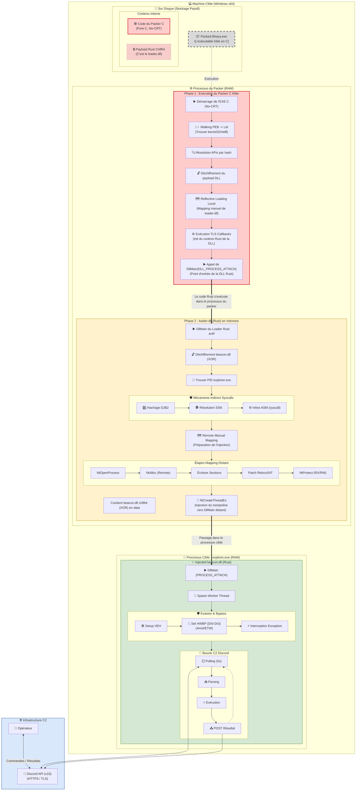

```mermaid
flowchart TB
    %% --- Styles ---
    %% Correction contraste: gris plus foncé pour le disque
    classDef disk fill:#d9d9d9,stroke:#555,stroke-width:3px,stroke-dasharray: 8 8;
    classDef cPacker fill:#ffcccc,stroke:#cc0000,stroke-width:2px;
    classDef rustLoader fill:#fff2cc,stroke:#d6b656,stroke-width:2px;
    classDef targetProcess fill:#d5e8d4,stroke:#82b366,stroke-width:2px;
    classDef c2 fill:#dae8fc,stroke:#6c8ebf,stroke-width:2px;
    classDef data fill:#f8cecc,stroke:#b85450,stroke-dasharray: 3 3;

    %% --- C2 Infrastructure (Top Layer) ---
    subgraph C2_Infra ["🌐 Infrastructure C2"]
        direction LR
        Operator["👤 Opérateur"] <-->|"Commandes / Résultats"| DiscordAPI["💬 Discord API (v10)\n(HTTPS / TLS)"]
    end
    class C2_Infra c2

    %% --- Target Machine ---
    subgraph TargetMachine ["💻 Machine Cible (Windows x64)"]
        direction TB

        %% --- Stage 0: On Disk (CORRIGÉ: Contraste et type de payload) ---
        subgraph Disk ["💾 Sur Disque (Stockage Passif)"]
            PackedBinary["📦 Packed Binary.exe\n(L'exécutable hôte en C)"]:::disk
            subgraph BinaryContents ["Contenu interne"]
                CStub["🛠️ Code du Packer C\n(Pure C, No-CRT)"]:::cPacker
                EncryptedRustPayload["🔒 Payload Rust Chiffré\n(C'est le loader.dll)"]:::data
            end
        end

        %% --- Stage 1 & 2: Initial Execution Process ---
        subgraph InitialProcess ["⚙️ Processus du Packer (RAM)"]
            direction TB

            %% --- Stage 1: C Packer Execution (CORRIGÉ: Chargement de DLL) ---
            subgraph Stage1_CPacker ["Phase 1 : Exécution du Packer C Hôte"]
                direction TB
                StartC["▶️ Démarrage de l'EXE C (No-CRT)"]
                PEBWalk["🚶‍♂️ Walking PEB -> Ldr\n(Trouver kernel32/ntdll)"]
                ResolveAPIs["🔍 Résolution APIs par hash"]
                DecryptDecompress["🔓 Déchiffrement du payload DLL"]
                ManualMapLocal["🗺️ Reflective Loading Local\n(Mapping manuel de loader.dll)"]
                HandleTLS["⚙️ Exécution TLS Callbacks\n(Init du runtime Rust de la DLL)"]
                CallDllMain["▶️ Appel de DllMain(DLL_PROCESS_ATTACH)\n(Point d'entrée de la DLL Rust)"]

                StartC --> PEBWalk --> ResolveAPIs --> DecryptDecompress --> ManualMapLocal --> HandleTLS --> CallDllMain
            end
            class Stage1_CPacker cPacker

            %% --- Transition Link ---
            CallDllMain ===>|"Le code Rust s'exécute dans le processus du packer"| StartRust

            %% --- Stage 2: Rust Loader Execution (La DLL chargée) ---
            subgraph Stage2_RustLoader ["Phase 2 : loader.dll (Rust) en mémoire"]
                direction TB
                StartRust["▶️ DllMain du Loader Rust actif"]
                noteLoader["Contient beacon.dll chiffré (XOR) en data"]
                
                subgraph IndirectSyscalls ["🛡️ Mécanisme Indirect Syscalls"]
                    ObfHash["#️⃣ Hachage DJB2"] --> ResolveSSN["🕵️ Résolution SSN"] --> AsmTrampoline["⚙️ Inline ASM (syscall)"]
                end

                DecryptBeacon["🔓 Déchiffrement beacon.dll (XOR)"]
                FindExplorer["🔎 Trouver PID explorer.exe"]
                RemoteMapping["🗺️ Remote Manual Mapping\n(Préparation de l'injection)"]
                
                subgraph RemoteMappingSteps ["Étapes Mapping Distant"]
                    NtOpen["NtOpenProcess"] --> NtAlloc["NtAlloc (Remote)"] --> MapSections["Écriture Sections"] --> PatchRelocs["Patch Relocs/IAT"] --> NtProtect["NtProtect (RX/RW)"]
                end

                InjectThread["💉 NtCreateThreadEx\n(Injection du trampoline vers DllMain distant)"]

                StartRust --> DecryptBeacon --> FindExplorer --> IndirectSyscalls --> RemoteMapping --> RemoteMappingSteps --> InjectThread
            end
            class Stage2_RustLoader rustLoader
        end

        %% --- Transition Link ---
        InjectThread ===>|"Passage dans le processus cible"| DllMainTrigger

        %% --- Stage 3: Final Payload in Target Process ---
        subgraph TargetProc ["🎯 Processus Cible : explorer.exe (RAM)"]
            direction TB
            
            subgraph InjectedBeacon ["✨ Injected beacon.dll (Rust)"]
                direction TB
                DllMainTrigger["▶️ DllMain (PROCESS_ATTACH)"] --> SpawnWorker["🧵 Spawn Worker Thread"]

                subgraph Evasion ["🛡️ Evasion & Bypass"]
                    SetupVEH["🛠️ Setup VEH"] --> SetHWBP["🎯 Set HWBP (Dr0-Dr3)\n(Amsi/ETW)"] --> CatchException["⚡ Interception Exception"]
                end

                subgraph C2Loop ["🔄 Boucle C2 Discord"]
                    Polling["⏲️ Polling (5s)"] --> CmdParse["📥 Parsing"] --> CmdExec["⚡ Exécution"] --> ResultPost["📤 POST Résultat"]
                    ResultPost -.-> Polling
                end

                SpawnWorker --> Evasion --> C2Loop
            end
            class InjectedBeacon targetProcess
        end
    end

    %% --- Connections to C2 ---
    Polling <--> DiscordAPI
    ResultPost --> DiscordAPI
    PackedBinary -.->|"Exécution"| StartC
```