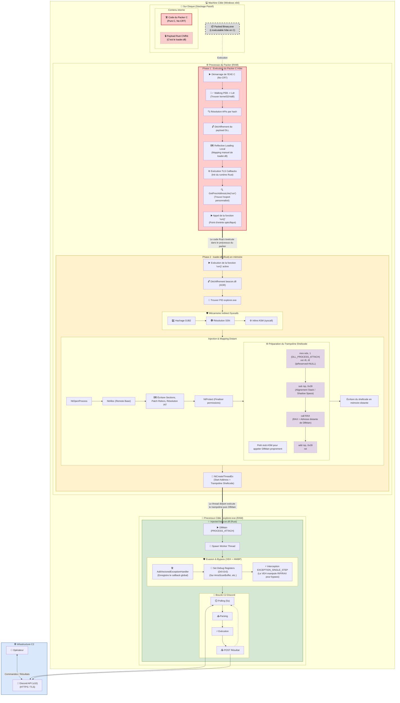

```mermaid
flowchart TB
    %% --- Styles Généraux ---
    classDef disk fill:#d9d9d9,stroke:#555,stroke-width:3px,stroke-dasharray: 8 8;
    classDef cPacker fill:#ffcccc,stroke:#cc0000,stroke-width:2px;
    classDef rustLoader fill:#fff2cc,stroke:#d6b656,stroke-width:2px;
    classDef targetProcess fill:#d5e8d4,stroke:#82b366,stroke-width:2px;
    classDef c2 fill:#dae8fc,stroke:#6c8ebf,stroke-width:2px;
    classDef data fill:#f8cecc,stroke:#b85450,stroke-dasharray: 3 3;
    classDef asm fill:#e1d5e7,stroke:#9673a6,stroke-width:1px,stroke-dasharray: 2 2;

    %% --- C2 Infrastructure (Top Layer) ---
    subgraph C2_Infra ["🌐 Infrastructure C2"]
        direction LR
        Operator["👤 Opérateur"] <-->|"Commandes / Résultats"| DiscordAPI["💬 Discord API (v10)\n(HTTPS / TLS)"]
    end
    class C2_Infra c2

    %% --- Target Machine ---
    subgraph TargetMachine ["💻 Machine Cible (Windows x64)"]
        direction TB

        %% --- Stage 0: On Disk ---
        subgraph Disk ["💾 Sur Disque (Stockage Passif)"]
            %% Note: Styles forcés en noir en bas du script
            PackedBinary["📦 Packed Binary.exe\n(L'exécutable hôte en C)"]:::disk
            subgraph BinaryContents ["Contenu interne"]
                CStub["🛠️ Code du Packer C\n(Pure C, No-CRT)"]:::cPacker
                EncryptedRustPayload["🔒 Payload Rust Chiffré\n(C'est le loader.dll)"]:::data
            end
        end

        %% --- Stage 1 & 2: Initial Execution Process ---
        subgraph InitialProcess ["⚙️ Processus du Packer (RAM)"]
            direction TB

            %% --- Stage 1: C Packer Execution (CORRECTION: Appel de run()) ---
            subgraph Stage1_CPacker ["Phase 1 : Exécution du Packer C Hôte"]
                direction TB
                StartC["▶️ Démarrage de l'EXE C (No-CRT)"]
                PEBWalk["🚶‍♂️ Walking PEB -> Ldr\n(Trouver kernel32/ntdll)"]
                ResolveAPIs["🔍 Résolution APIs par hash"]
                DecryptDecompress["🔓 Déchiffrement du payload DLL"]
                ManualMapLocal["🗺️ Reflective Loading Local\n(Mapping manuel de loader.dll)"]
                HandleTLS["⚙️ Exécution TLS Callbacks\n(Init du runtime Rust)"]
                GetProcAddrRun["🔍 GetProcAddressLike('run')\n(Trouve l'export personnalisé)"]
                CallRunApi["▶️ Appel de la fonction 'run()'\n(Point d'entrée spécifique)"]

                StartC --> PEBWalk --> ResolveAPIs --> DecryptDecompress --> ManualMapLocal --> HandleTLS --> GetProcAddrRun --> CallRunApi
            end
            class Stage1_CPacker cPacker

            %% --- Transition Link ---
            CallRunApi ===>|"Le code Rust s'exécute dans le processus du packer"| StartRustRun

            %% --- Stage 2: Rust Loader Execution (CORRECTION: Trampoline Detail) ---
            subgraph Stage2_RustLoader ["Phase 2 : loader.dll (Rust) en mémoire"]
                direction TB
                StartRustRun["▶️ Exécution de la fonction 'run()' active"]
                
                subgraph IndirectSyscalls ["🛡️ Mécanisme Indirect Syscalls"]
                    ObfHash["#️⃣ Hachage DJB2"] --> ResolveSSN["🕵️ Résolution SSN"] --> AsmTrampolineNode["⚙️ Inline ASM (syscall)"]
                end

                DecryptBeacon["🔓 Déchiffrement beacon.dll (XOR)"]
                FindExplorer["🔎 Trouver PID explorer.exe"]
                
                subgraph RemoteMappingFlow ["Injection & Mapping Distant"]
                    NtOpen["NtOpenProcess"]
                    NtAlloc["NtAlloc (Remote Base)"]
                    RemoteMappingSteps["🗺️ Écriture Sections, Patch Relocs, Résolution IAT"]
                    NtProtect["NtProtect (Finaliser permissions)"]
                    
                    subgraph TrampolinePrep ["⚙️ Préparation du Trampoline Shellcode"]
                        direction TB
                        noteTrampo["Petit stub ASM pour appeler DllMain proprement"]
                        T_Params["mov edx, 1 (DLL_PROCESS_ATTACH)\nxor r8, r8 (lpReserved=NULL)"]:::asm
                        T_Stack["sub rsp, 0x28\n(Alignement Stack / Shadow Space)"]:::asm
                        T_Call["call RAX\n(RAX = Adresse distante de DllMain)"]:::asm
                        T_Cleanup["add rsp, 0x28\nret"]:::asm
                        T_Params --> T_Stack --> T_Call --> T_Cleanup
                    end

                    WriteTrampo["Écriture du shellcode en mémoire distante"]
                    
                    NtOpen --> NtAlloc --> RemoteMappingSteps --> NtProtect --> TrampolinePrep --> WriteTrampo
                end

                InjectThread["💉 NtCreateThreadEx\n(Start Address = Trampoline Shellcode)"]

                StartRustRun --> DecryptBeacon --> FindExplorer --> IndirectSyscalls --> RemoteMappingFlow --> InjectThread
            end
            class Stage2_RustLoader rustLoader
        end

        %% --- Transition Link ---
        InjectThread ===>|"Le thread distant exécute le trampoline puis DllMain"| DllMainTrigger

        %% --- Stage 3: Final Payload in Target Process ---
        subgraph TargetProc ["🎯 Processus Cible : explorer.exe (RAM)"]
            direction TB
            
            subgraph InjectedBeacon ["✨ Injected beacon.dll (Rust)"]
                direction TB
                DllMainTrigger["▶️ DllMain (PROCESS_ATTACH)"] --> SpawnWorker["🧵 Spawn Worker Thread"]

                subgraph Evasion ["🛡️ Evasion & Bypass (VEH + HWBP)"]
                    SetupVEH["🛠️ AddVectoredExceptionHandler\n(Enregistre le callback global)"]
                    SetHWBP["🎯 Set Debug Registers (Dr0-Dr3)\n(Sur AmsiScanBuffer, etc.)"]
                    CatchException["⚡ Interception EXCEPTION_SINGLE_STEP\n(Le VEH manipule RIP/RAX pour bypass)"]
                    SetupVEH --> SetHWBP --> CatchException
                end

                subgraph C2Loop ["🔄 Boucle C2 Discord"]
                    Polling["⏲️ Polling (5s)"] --> CmdParse["📥 Parsing"] --> CmdExec["⚡ Exécution"] --> ResultPost["📤 POST Résultat"]
                    ResultPost -.-> Polling
                end

                SpawnWorker --> Evasion --> C2Loop
            end
            class InjectedBeacon targetProcess
        end
    end

    %% --- Connections to C2 ---
    Polling <--> DiscordAPI
    ResultPost --> DiscordAPI
    PackedBinary -.->|"Exécution"| StartC

    %% --- FORCED BLACK TEXT STYLES ---
    style PackedBinary color:black
    style CStub color:black
    style EncryptedRustPayload color:black
```